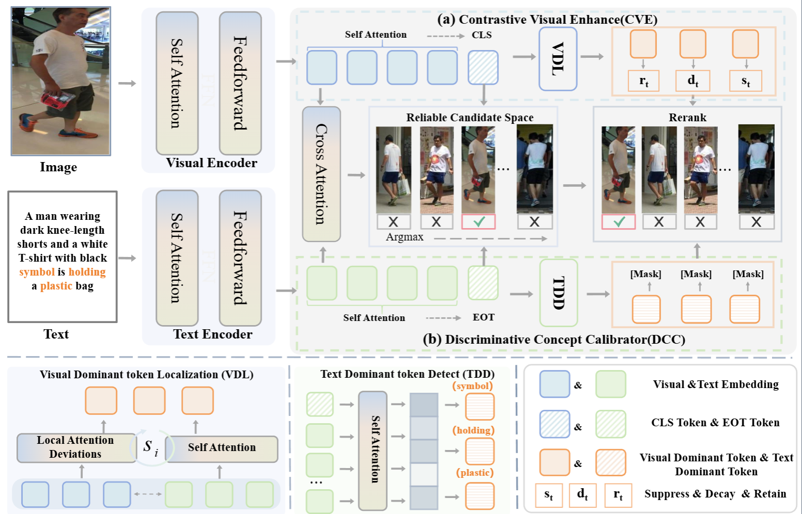

# CalibCLIP: Contextual Calibration of Dominant Semantics for Text-Driven Image Retrieval


<p align="center">
  <a href="https://doi.org/10.1145/3746027.3755765"></a>
  <a href="https://doi.org/10.1145/3746027.3755765"></a>
  <a href="https://pytorch.org/"></a>
  <a href="LICENSE"></a>
  <a href="https://python.org/"></a>
</p>

<p align="center">
  <b>Official PyTorch implementation of CalibCLIP (ACM MM 2025)</b>
</p>

<p align="center">
  <a href="#-highlights">Highlights</a> •
  <a href="#-installation">Installation</a> •
  <a href="#-quick-start">Quick Start</a> •
  <a href="#-datasets">Datasets</a> •
  <a href="#-model-zoo">Model Zoo</a> •
  <a href="#-results">Results</a> •
  <a href="#-citation">Citation</a>
</p>

---

## 📰 News

- **[2025.08]** 🎉 CalibCLIP is accepted by **ACM MM 2025**!
- **[2025.11]** 📦 Code are released.

---

## 🌟 Highlights

<p align="center">
  
</p>

CalibCLIP addresses the **dominant semantics bias** problem in CLIP-based text-driven image retrieval through two key innovations:

### 🔬 Calibrated Vision Encoder (CVE)
- Dynamically recalibrates visual features using **cross-modal contextual information**
- Mitigates over-reliance on dominant visual patterns (e.g., clothing color)
- Enables fine-grained discrimination between visually similar images

### 📚 Dual Curriculum Contrastive Learning (DCC)
- Progressive training strategy with **image-level** and **text-level** curricula
- Gradually increases sample difficulty during training
- Enhances model robustness to hard negative samples
---

## 🛠 Installation

### Requirements

- Python >= 3.8
- PyTorch >= 2.0
- CUDA >= 11.7 (recommended)

### Setup Environment

```bash
# Clone repository
git clone https://github.com/your-username/CalibCLIP.git
cd CalibCLIP

# Create conda environment
conda create -n calibclip python=3.9 -y
conda activate calibclip

# Install PyTorch (CUDA 11.8)
pip install torch==2.1.0 torchvision==0.16.0 --index-url https://download.pytorch.org/whl/cu118

# Install dependencies
pip install -r requirements.txt

# Install CalibCLIP
pip install -e .
```

### requirements.txt

```
torch>=2.0.0
torchvision>=0.15.0
numpy>=1.21.0
scipy>=1.7.0
Pillow>=9.0.0
PyYAML>=6.0
tqdm>=4.62.0
tensorboard>=2.10.0
matplotlib>=3.5.0
ftfy>=6.1.0
regex>=2022.1.18
```

---

## 🚀 Quick Start

### Single Model Evaluation

```bash
python scripts/evaluate.py \
    --config configs/cuhkpedes.yaml \
    --checkpoint checkpoints/calibclip_cuhkpedes.pth \
    --data_root /path/to/CUHK-PEDES \
    --output_dir results/
```

### Batch Evaluation (Multiple Datasets)

```bash
python scripts/batch_evaluate.py \
    --checkpoint checkpoints/calibclip_cuhkpedes.pth \
    --datasets cuhkpedes icfgpedes rstp \
    --data_roots /path/to/CUHK-PEDES /path/to/ICFG-PEDES /path/to/RSTPReid \
    --output_dir results/batch/
```

### Interactive Demo

```bash
python scripts/demo.py \
    --config configs/cuhkpedes.yaml \
    --checkpoint checkpoints/calibclip_cuhkpedes.pth \
    --image_dir /path/to/images \
    --query "A woman wearing a red dress"
```

### Python API

```python
from calibclip import CalibCLIP, build_calibclip
from calibclip.datasets import build_transforms
from calibclip.evaluation import Evaluator

# Build model
model = build_calibclip(
    pretrained="checkpoints/calibclip_cuhkpedes.pth",
    embed_dim=512,
    vision_layers=12,
    text_layers=12,
)
model.eval()

# Build transforms
transform = build_transforms(is_train=False, image_size=(384, 128))

# Run evaluation
evaluator = Evaluator(model, device="cuda")
results = evaluator.evaluate(dataloader)
print(f"Rank-1: {results['rank1']:.2f}%")
```

---

## 📊 Datasets

### Supported Datasets

| Dataset | Images | IDs | Captions | Download |
|---------|--------|-----|----------|----------|
| [CUHK-PEDES](https://github.com/ShuangLI59/Person-Search-with-Natural-Language-Description) | 40,206 | 13,003 | 80,412 | [Link](https://github.com/ShuangLI59/Person-Search-with-Natural-Language-Description) |
| [ICFG-PEDES](https://github.com/zifyloo/SSAN) | 54,522 | 4,102 | 54,522 | [Link](https://github.com/zifyloo/SSAN) |
| [RSTPReid](https://github.com/NjtechCVLab/RSTPReid-Dataset) | 20,505 | 4,101 | 41,010 | [Link](https://github.com/NjtechCVLab/RSTPReid-Dataset) |

### Dataset Preparation

```
data/
├── CUHK-PEDES/
│   ├── imgs/
│   │   ├── cam_a/
│   │   ├── cam_b/
│   │   └── ...
│   └── annotations/
│       ├── train.json
│       ├── val.json
│       └── test.json
├── ICFG-PEDES/
│   ├── imgs/
│   └── annotations/
└── RSTPReid/
    ├── imgs/
    └── annotations/
```

---


### 🔌 CalibCLIP as Plug-and-Play Module

CalibCLIP can be seamlessly integrated into existing CLIP-based methods as a plug-and-play module:

#### On CLIP-ViT/16 Baseline

| Dataset | Metric | Baseline | +CalibCLIP | Improvement |
|---------|--------|:--------:|:----------:|:-----------:|
| **CUHK-PEDES** | R@1 | 66.54 | **71.88** | +5.34 |
| | R@5 | 86.94 | **90.50** | +3.56 |
| | R@10 | 91.77 | **94.75** | +2.98 |
| | mAP | 62.69 | **65.22** | +2.53 |
| **ICFG-PEDES** | R@1 | 57.44 | **62.54** | +5.10 |
| | R@5 | 75.79 | **80.18** | +4.39 |
| | R@10 | 82.22 | **84.57** | +2.35 |
| | mAP | 33.03 | **37.37** | +4.34 |
| **RSTPReid** | R@1 | 56.67 | **60.30** | +3.63 |
| | R@5 | 78.09 | **82.78** | +4.69 |
| | R@10 | 86.62 | **88.66** | +2.04 |
| | mAP | 44.25 | **46.47** | +2.22 |


## 🔧 Configuration

### Base Configuration

```yaml
# configs/base.yaml
model:
  name: "calibclip"
  embed_dim: 512
  vision_layers: 12
  vision_width: 768
  vision_patch_size: 16
  text_layers: 12
  text_width: 512
  text_heads: 8
  vocab_size: 49408

  # CVE settings
  cve:
    enabled: true
    num_heads: 8
    num_layers: 2
    dropout: 0.1
  
  # DCC settings
  dcc:
    enabled: true
    temperature: 0.07
    image_curriculum_epochs: [10, 20, 30]
    text_curriculum_epochs: [15, 25, 35]

data:
  image_size: [384, 128]
  max_length: 77

evaluation:
  batch_size: 128
```

---

## 🧪 Testing

```bash
# Run all tests
pytest tests/ -v

# Run specific test
pytest tests/test_models.py -v

# Test with coverage
pytest tests/ --cov=calibclip --cov-report=html
```

---

## 📝 Training (Coming Soon)

Training code will be released soon. Stay tuned!

```bash
# Training example (placeholder)
python tools/train.py \
    --config configs/cuhkpedes.yaml \
    --data_root /path/to/CUHK-PEDES \
    --output_dir outputs/
```

---

## 🙏 Acknowledgements

This project is built upon the following excellent works:

- [CLIP](https://github.com/openai/CLIP) - Contrastive Language-Image Pre-training
- [IRRA](https://github.com/anosorae/IRRA) - Cross-Modal Implicit Relation Reasoning
- [TransReID](https://github.com/damo-cv/TransReID) - Transformer-based Object Re-Identification

We thank the authors for their valuable contributions to the community.

---

## 📄 License

This project is licensed under the MIT License - see the [LICENSE](LICENSE) file for details.

---

## 📧 Contact

For questions or discussions, please:
- Open an issue in this repository
- Contact: [kangbin23@mails.ucas.ac.cn]

---

## 📖 Citation

If you find CalibCLIP useful in your research, please consider citing:

```bibtex
@inproceedings{10.1145/3746027.3755765,
  author = {Kang, Bin and Chen, Bin and Wang, Junjie and Li, Yulin and Zhao, Junzhi and Wang, Junle and Tian, Zhuotao},
  title = {CalibCLIP: Contextual Calibration of Dominant Semantics for Text-Driven Image Retrieval},
  year = {2025},
  booktitle = {Proceedings of the 33rd ACM International Conference on Multimedia}
}
```

---

<p align="center">
  Made with ❤️ by the CalibCLIP Team
</p>
